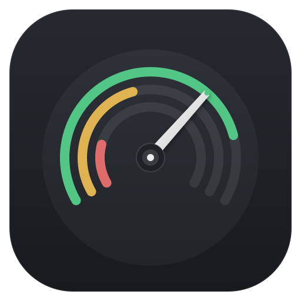
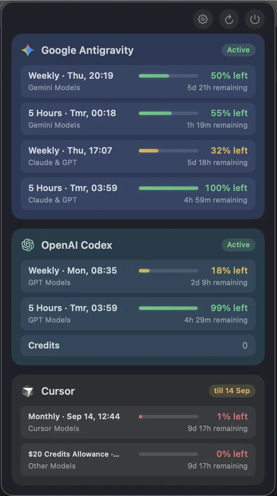
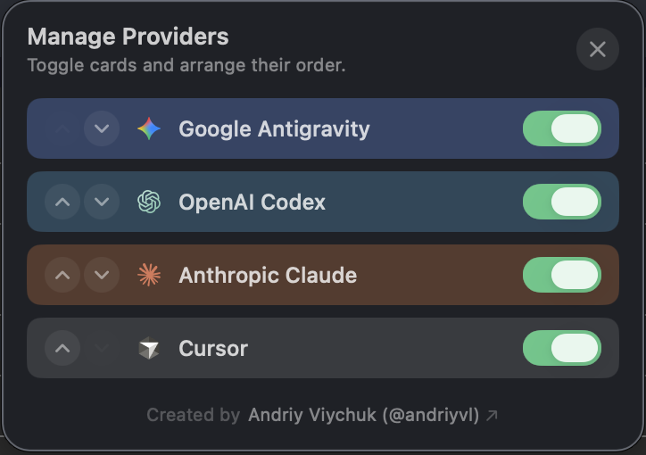

<p align="center">
  
</p>


# AI Limits

A lightweight, native macOS Menu Bar app to monitor real-time usage quotas, session caps, weekly rate limits, and credits across AI coding assistants and models.

Supported providers:
- **Google Antigravity** (Gemini models: 5-hour rolling session & weekly quota)
- **OpenAI Codex** (Codex & ChatGPT models: 5-hour window, weekly quota, credits)
- **Anthropic Claude** (5-hour and 7-day usage windows, plus Sonnet and Opus caps)
- **Cursor** (Cursor Models & Other Models usage allowance, credits, subscription renewal date)

---

## Highlights

- **Zero API Key Configuration**: Reads active local workstation session credentials directly from existing developer tool logins (`~/.codex/auth.json`, `~/.claude/.credentials.json`, Cursor local state, Antigravity local app storage).
- **100% Private & Local**: Communicates directly from your Mac to official provider endpoints. No middleman servers, analytics, or third-party telemetry.
- **Native SwiftUI Menu Bar Extra**: Lives unobtrusively in your menu bar. Click to inspect live linear progress bars, exact percentage remaining, countdown timers, and expiration badges.
- **Subscription End Dates**: Color-coded badges (`till MMM d`) highlighting days remaining until billing cycle renewal.
- **Customizable Order & Toggles**: Reorder providers and hide inactive ones directly in settings.
- **CLI Terminal Preview**: Inspect limits in any terminal using Unicode progress bars.

---

## How it looks
<p align="center">
  
  
</p>

## Requirements

- macOS 14.0 or later
- Apple Silicon (arm64) or Intel (x86_64)
- Swift 6.0+ / Xcode 16+

---

## Getting Started

### Build and Launch

Clone the repository and run:

```bash
make run
```

This compiles the release binary and opens `dist/AI Limits.app`.

### Build App Bundle Only

```bash
make build
```

The self-contained app bundle will be placed in `dist/AI Limits.app`.

### Terminal Preview

To inspect current limits without launching the GUI menu bar app:

```bash
make preview
```

or:

```bash
swift run provider-limits
```

### Run Tests

```bash
swift test
```

---

## Architecture

- **`Sources/ProviderLimitsCore`**: Core domain logic, normalized data models (`ProviderUsageSnapshot`, `LimitMetric`), provider clients (`AntigravityProvider`, `CodexProvider`, `ClaudeProvider`, `CursorProvider`), and SwiftUI progress bar components.
- **`App/`**: Native macOS `MenuBarExtra` host application (`MenuBarHostApp.swift`, `MenuBarContentView.swift`).
- **`Sources/ProviderLimitsCLI`**: Terminal preview tool for fast headless inspection.

---

## Author & License

Created by Andriy Viychuk ([@andriyvl](https://github.com/andriyvl)).

AI Limits is licensed under the [Apache License 2.0](LICENSE).

You may use, modify, fork, and redistribute it, including commercially. Redistributions and forks must preserve the license, copyright, and attribution notice in [NOTICE](NOTICE). Apache 2.0 does not require visible in-app credit.
